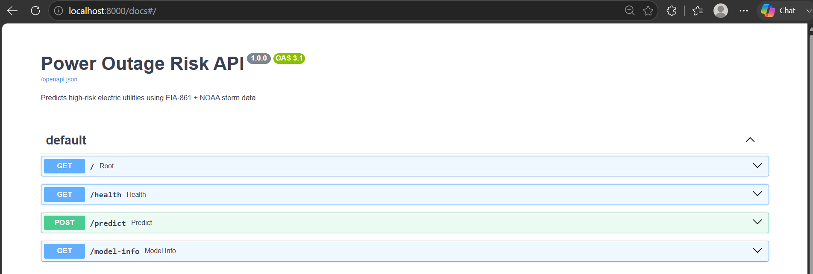
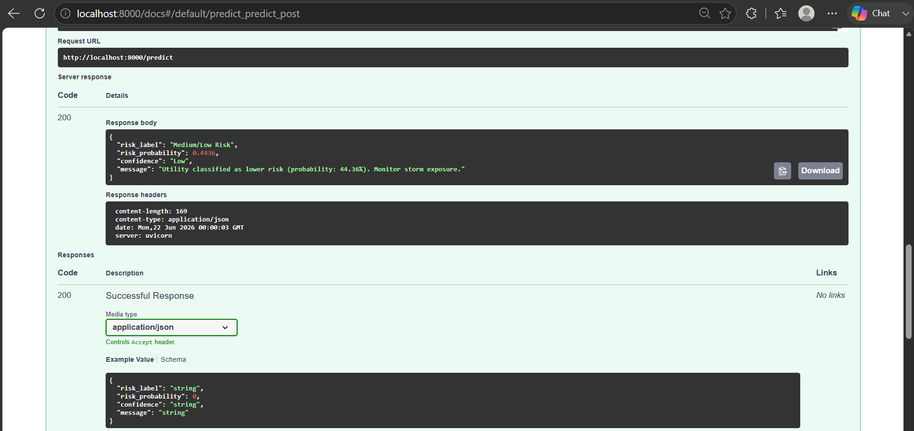

# ⚡ Power Outage Risk Analysis Pipeline

[](https://github.com/SejalKhade/Power-Outage-Risk-Dashboard/actions/workflows/ci.yml)
[](https://sejjjallll-power-outage-risk-dashboard.hf.space)
[](https://python.org)

**Can we predict which electric utilities are most likely to fail before the next storm?**

That is the question this project answers. It combines EIA-861 reliability data with NOAA storm records, runs 28 ML experiments, and deploys results as a live dashboard and REST API.

---

## If you are a recruiter — start here

| What | Where |
|---|---|
| 🌐 Live Dashboard | [sejjjallll-power-outage-risk-dashboard.hf.space](https://sejjjallll-power-outage-risk-dashboard.hf.space) |
| ✅ CI Passing | [Actions tab](https://github.com/SejalKhade/Power-Outage-Risk-Dashboard/actions) |
| 🐳 API (Docker) | `docker build -t power-outage-risk . && docker run -p 8000:8000 power-outage-risk` |
| 📖 API Docs | `uvicorn api.main:app --reload` → `localhost:8000/docs` |
| 📊 Key numbers | 336 of 1,677 utilities flagged High Risk · $74.5B estimated annual loss |

---

## Screenshots

### Dashboard


### FastAPI — Swagger UI


### FastAPI — Prediction Response


### MLflow — 28 Experiments


---

## Why this problem matters

Power outages are not random. Some utilities fail repeatedly during storms while others in the same region barely blink. The difference comes down to grid age, ownership type, storm frequency, and geographic exposure.

The problem is that utilities self-report reliability data to the federal government (EIA Form 861) and no one has built a tool to automatically flag which ones are quietly getting worse. Grid operators, infrastructure investors, and state regulators need to know which utilities need attention before a storm — not after customers lose power for days.

This project builds that early-warning system.

---

## What I built

```
Stage 1 — src/preprocess.py
    3,441,222 raw records from EIA-861 + NOAA Storm Events 2024
    Chunked processing (200K rows at a time) — runs on a normal laptop
    Logging with timestamps — not print statements
    Output: clean parquet file

Stage 2 — src/features.py
    Aggregates to 1,677 utility-level rows
    Engineers 46 features — SAIDI/SAIFI ranks, storm damage,
    economic estimates, NERC region flags, ownership type
    Detects and removes data leakage
    Output: utility_features.parquet

Stage 3 — src/train.py
    28 experiments in MLflow
    7 classifiers × 2 feature sets × 2 label thresholds
    Honest leakage-corrected metrics
    Output: best_model.pkl + sensitivity_results.csv

Stage 4 — api/main.py
    FastAPI REST endpoint
    POST /predict → risk label + probability
    GET /health → model status
    Containerized with Docker
```

---

## Numbers — all verified from actual data

| Metric | Value |
|---|---|
| Raw records processed | 3,441,222 |
| Utility-level features | 46 |
| Utilities analyzed | 1,677 across 50 states |
| High Risk utilities | **336 (20%)** |
| NERC SLA breaches | **391 utilities** |
| Estimated annual economic loss | **$74.5B** |
| Worst utility | Altamaha Electric, GA — 17,313 min/yr SAIDI |
| Top High Risk states | TN (31) · TX (23) · KY (23) · GA (20) · NC (19) |
| Cooperatives as % of High Risk | **64.6%** |
| SERC region avg SAIDI | **405 min/yr** (worst major region) |
| Best model | Logistic Regression + Weather features |
| ROC-AUC (leakage-corrected) | **0.668** |
| PR-AUC | **0.325** |
| F1 Score | **0.446** |
| Recall | **0.642** |
| Weather feature lift | **+54% ROC-AUC** (0.50 → 0.77 peak) |

---

## The data leakage problem

When I first ran the models, ROC-AUC came back as 1.0.

That is a red flag, not a good result. A perfect score on real-world data almost always means the model is cheating.

I found three engineered features that were causing it:

- `estimated_annual_loss_usd` — calculated as SAIDI × customers × $27/hour
- `nerc_sla_breach_risk` — literally (SAIDI > 150) in binary form
- `sla_breach_margin_min` — SAIDI − 150

All three are derived directly from SAIDI, which defines the target variable. The model was not predicting risk — it was reading the answer from a different column.

After removing all SAIDI-derived features, ROC-AUC corrected to 0.668. That is the real number.

---

## Why weather features matter

- Utility-only features (grid structure, ownership, NERC flags) → ROC-AUC = **0.50** — random guessing
- Add storm/weather features → ROC-AUC = **0.77** — +54% improvement

Grid structure alone cannot predict reliability risk. Storm exposure is what separates high-risk utilities from the rest. This is an actionable finding — infrastructure investors and grid operators need both dimensions.

---

## All 28 experiment results

| Model | Feature Set | Threshold | ROC-AUC | PR-AUC | F1 |
|---|---|---|---|---|---|
| **Logistic Regression** | **Utility + Weather** | **Top 20%** | **0.668** | **0.325** | **0.446** |
| Extra Trees | Utility + Weather | Top 20% | 0.686 | 0.295 | 0.428 |
| Random Forest | Utility + Weather | Top 20% | 0.677 | 0.286 | 0.424 |
| XGBoost | Utility + Weather | Top 20% | 0.669 | 0.280 | 0.420 |
| LightGBM | Utility + Weather | Top 20% | 0.669 | 0.280 | 0.420 |
| All models | Utility Only | Any | 0.500 | — | — |

Full results: `outputs/models/sensitivity_results.csv`

---

## Key findings

**Why Cooperatives?**
64.6% of High Risk utilities are Cooperatives. They serve rural areas with older infrastructure, smaller capital budgets, and longer transmission lines exposed to storm damage. Fewer redundant circuits means when one line goes down, the whole territory loses power.

**Why Tennessee?**
TN sits in the SERC reliability region and gets hit by ice storms, tornadoes, and severe thunderstorms. Most High Risk utilities there are rural cooperatives in mountainous terrain where line repair takes longer.

**What is SAIDI?**
System Average Interruption Duration Index — average total minutes a customer loses power per year. Altamaha Electric in Georgia: 17,313 min/yr = roughly 12 days without power per customer annually.

**How is $74.5B calculated?**
DOE methodology: (SAIDI minutes ÷ 60) × estimated customers × $27/customer-hour. Consistent basis for comparing all 1,677 utilities.

---

## Business applications

**Grid operators** — focus review on 336 High Risk utilities instead of all 1,677. 80% reduction in scope.

**Infrastructure investors** — 391 utilities exceeding the NERC threshold signals where regulatory action is most likely. Relevant for investment risk assessment.

**Emergency planners** — cluster maps show where High Risk utilities concentrate. Pre-position repair crews before a storm hits that cluster.

---

## FastAPI endpoints

| Method | Endpoint | What it does |
|---|---|---|
| GET | `/` | Project info |
| GET | `/health` | Model loaded status |
| GET | `/model-info` | Model type and metrics |
| POST | `/predict` | Returns risk label + probability |

**Run locally:**
```bash
uvicorn api.main:app --reload
# Open: http://localhost:8000/docs
```

**Run with Docker:**
```bash
docker build -t power-outage-risk .
docker run -p 8000:8000 power-outage-risk
# Same docs at: http://localhost:8000/docs
```

**Example request:**
```bash
curl -X POST "http://localhost:8000/predict" \
  -H "Content-Type: application/json" \
  -d '{
    "weather_event_count": 82,
    "total_damage_usd": 1500000,
    "INJURIES_DIRECT": 2,
    "DEATHS_DIRECT": 0,
    "MAGNITUDE": 45.0,
    "months_with_events": 7,
    "County_Count": 5,
    "SERC": 1,
    "Ownership": "Cooperative",
    "NERC_Region": "SERC"
  }'
```

**Example response:**
```json
{
  "risk_label": "High Risk",
  "risk_probability": 0.6821,
  "confidence": "High",
  "message": "Utility flagged as HIGH RISK (probability: 68.21%). Recommend infrastructure review."
}
```

---

## CI/CD

Every push to `main` triggers GitHub Actions automatically:

```
Push code
  → Ubuntu server spins up
  → Python 3.11 + dependencies install
  → 7 pipeline files verified
  → FastAPI imports tested
  → src.utils imports tested
  → 5 unit tests run (pytest)
  → Pass ✓ or Fail ✗
```

Currently passing. Badge at top of this README shows live status.

---

## Run it yourself

```bash
# Clone
git clone https://github.com/SejalKhade/Power-Outage-Risk-Dashboard.git
cd Power-Outage-Risk-Dashboard

# Setup
python -m venv venv
venv\Scripts\activate        # Windows
pip install -r requirements.txt

# Get data (~2GB)
# Download: https://drive.google.com/file/d/1ppvx0fkmi1QdsbZOnhZ-LAEc-BPF52DS/view
# Place at: data/raw/merged_utility_storm_2024.csv

# Run pipeline
python -m src.preprocess     # ~5 min
python -m src.features       # ~30 sec
python -m src.train          # ~5 min

# View MLflow results
mlflow ui                    # http://localhost:5000

# Run API
uvicorn api.main:app --reload    # http://localhost:8000/docs

# Docker
docker build -t power-outage-risk .
docker run -p 8000:8000 power-outage-risk

# Dashboard locally
python dashboard/app_gradio.py   # http://localhost:7860
```

---

## Project structure

```
power-outage-risk/
├── .github/workflows/ci.yml     GitHub Actions CI
├── src/
│   ├── preprocess.py            Stage 1 — raw data → clean parquet
│   ├── features.py              Stage 2 — 46 utility-level features
│   ├── train.py                 Stage 3 — 28 MLflow experiments
│   └── utils.py                 Shared helpers
├── api/
│   └── main.py                  FastAPI REST endpoint
├── dashboard/
│   └── app_gradio.py            Gradio dashboard (HF Spaces)
├── tests/
│   └── test_utils.py            5 unit tests (pytest)
├── outputs/models/
│   ├── best_model.pkl
│   ├── metrics.json
│   └── sensitivity_results.csv
├── docs/images/                 Screenshots
├── conftest.py
├── Dockerfile
└── requirements.txt
```

---

## Stack

Python · Pandas · NumPy · Scikit-learn · XGBoost · LightGBM · MLflow · FastAPI · Uvicorn · Pydantic · Gradio · Folium · Plotly · Docker · GitHub Actions · Hugging Face Spaces

Data: EIA Form 861 · NOAA Storm Events Database · 2024

---

**Sejal Khade** · MS Data Science, University of Texas at Arlington · May 2026

[GitHub](https://github.com/SejalKhade) · [LinkedIn](https://linkedin.com/in/sejallk) · [Dashboard](https://sejjjallll-power-outage-risk-dashboard.hf.space)
